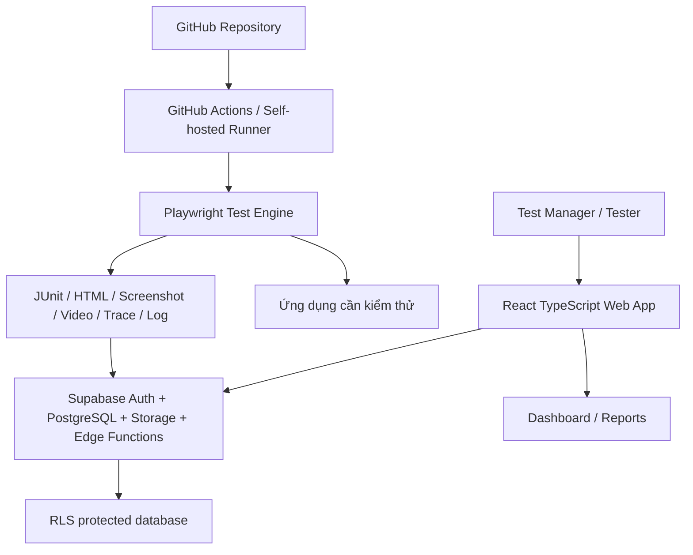

# UC-TEST-SDD

## Thông tin tài liệu

| Thuộc tính | Giá trị |
| --- | --- |
| Tên tài liệu | Tài liệu thiết kế hệ thống nền tảng quản lý và kiểm thử chức năng theo Use Case |
| Phiên bản | 2.0 |
| Ngày ban hành | 15/07/2026 |
| Trạng thái | Baseline triển khai |
| Kho quản lý | `/docs` trong repository |

## Phạm vi v2.0

- Quản lý dự án, phiên bản ứng dụng, môi trường kiểm thử và đợt kiểm thử.
- Quản lý UC, Test Scenario, Test Case và ma trận truy vết RTM.
- Hỗ trợ tester ghi nhận kết quả thủ công và minh chứng.
- Chạy kiểm thử tự động giao diện web bằng Playwright.
- Kích hoạt kiểm thử bằng GitHub Actions hoặc self-hosted runner.
- Thu thập screenshot, video, trace, log, JUnit, HTML report và JSON summary.
- Đồng bộ kết quả vào Supabase và hiển thị trên dashboard.
- Quản lý defect, retest và báo cáo nghiệm thu.

## Kiến trúc



## Chức năng baseline

| Mã | Chức năng |
| --- | --- |
| F01 | Quản lý người dùng và vai trò |
| F02 | Quản lý dự án |
| F03 | Quản lý phiên bản ứng dụng |
| F04 | Quản lý môi trường kiểm thử |
| F05 | Quản lý UC |
| F06 | Quản lý Test Scenario |
| F07 | Quản lý Test Case |
| F08 | Ma trận RTM |
| F09 | Quản lý script tự động |
| F10 | Tạo Test Run |
| F11 | Chạy kiểm thử thủ công |
| F12 | Kích hoạt kiểm thử tự động |
| F13 | Tiếp nhận kết quả tự động |
| F14 | Quản lý minh chứng |
| F15 | Quản lý lỗi |
| F16 | Dashboard |
| F17 | Báo cáo kiểm thử |
| F18 | Quản lý thay đổi và audit log |
| F19 | Cấu hình tích hợp không bí mật |
| F20 | Quản lý dữ liệu kiểm thử |
| F21 | Lịch chạy và hồi quy |
| F22 | Kiểm soát chất lượng script |

## Trạng thái kết quả

- `Pass`: Actual Result đáp ứng Expected Result.
- `Fail`: Không đáp ứng Expected Result hoặc có lỗi chức năng.
- `Blocked`: Không thể thực hiện do phụ thuộc, môi trường hoặc dữ liệu.
- `Not Run`: Chưa thực hiện.
- `Flaky`: Kết quả không ổn định, không tự coi là Pass nghiệm thu.
- `Infrastructure Error`: Lỗi runner, mạng hoặc công cụ, không đồng nhất với lỗi ứng dụng.

## Quy tắc automation

Tên test phải chứa UC ID và Test Case ID:

```ts
test.describe('@project:KTKT @module:user @suite:smoke', () => {
  test('UC-USER-001 | TC-USER-001 | Viewer chỉ xem dashboard được phân quyền', async ({ page }) => {
    // steps and assertions
  });
});
```

Đầu ra bắt buộc gồm JUnit XML, Playwright HTML report, JSON summary, screenshot/trace khi lỗi, video theo chính sách dự án và checksum evidence.

## Bảo mật

- Bật RLS cho toàn bộ bảng nghiệp vụ truy cập từ client.
- Tách quyền theo `project_id` và vai trò.
- Không lưu mật khẩu ứng dụng cần test dạng rõ.
- Không đưa service-role key vào Netlify frontend.
- Ghi audit log cho thay đổi UC, Test Case, result thủ công, lock/unlock Test Run và cấu hình tích hợp.
- Test Run đã khóa không cho sửa trực tiếp result; thay đổi phải tạo phiên bản hoặc biên bản mới.

## Tiêu chí nghiệm thu v2.0

- Người dùng đăng nhập và chỉ truy cập dự án được phân quyền.
- Tạo/import được UC, Test Case và hiển thị RTM.
- Tạo Test Run gắn phiên bản ứng dụng và môi trường.
- Kích hoạt Playwright với Test Run ID.
- Runner thực hiện tối thiểu một luồng end-to-end.
- Kết quả ánh xạ đúng Test Case.
- Có screenshot và trace cho kịch bản Fail.
- Dashboard tổng hợp từ dữ liệu gốc.
- Defect được tạo từ kết quả Fail.
- Test Run đã khóa ngăn sửa result trực tiếp.
- Không lộ secret trong repository, frontend bundle hoặc log.
- Tài liệu thiết kế, changelog và release note đồng bộ với mã nguồn.
