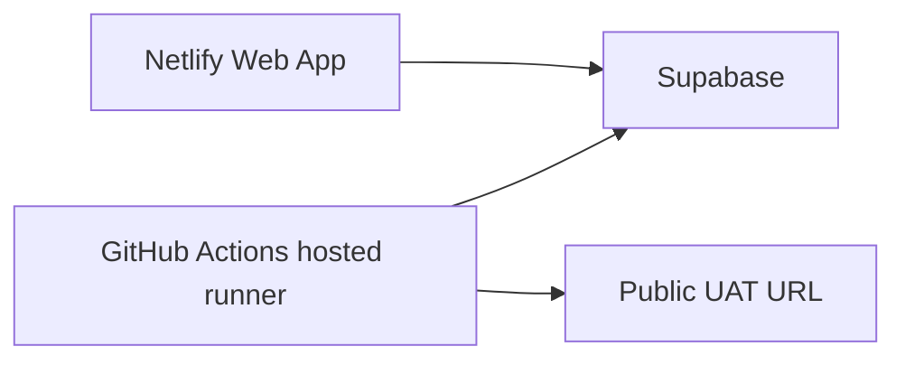
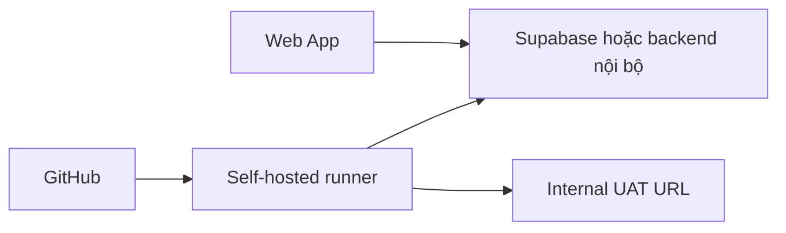

# Deployment

## Internet-accessible

```mermaid
flowchart LR
  Netlify["Netlify Web App"] --> Supabase["Supabase"]
  Actions["GitHub Actions hosted runner"] --> UAT["Public UAT URL"]
  Actions --> Supabase
```

## Internal network

```mermaid
flowchart LR
  Web["Web App"] --> Supabase["Supabase hoặc backend nội bộ"]
  GitHub["GitHub"] --> Runner["Self-hosted runner"]
  Runner --> InternalApp["Internal UAT URL"]
  Runner --> Supabase
```

Self-hosted runner phải được quản lý như tài sản hạ tầng riêng, có tài khoản dịch vụ, kiểm soát kết nối, cập nhật bản vá và giám sát.
